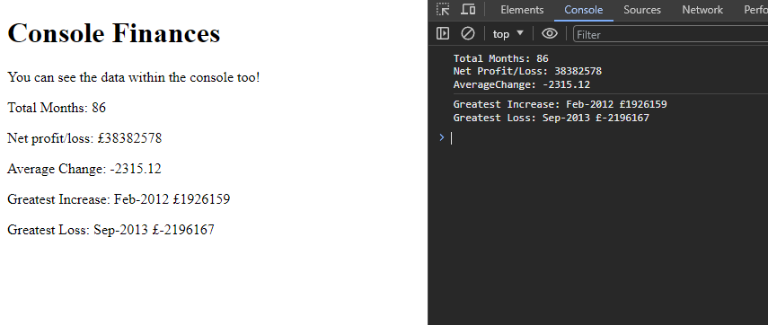

# Console Finances

This project was designed as a simple JS program to display calculations based on a given financial data set. 

The goal to the project is to evaluate and calculate:

1. The total number of months in the dataset
2. The net total of Profit / Loss over the entire period
3. The average of the changes in Profit / Loss
4. The greatest increase in Profit / Loss over the entire period
5. The greatest decrease in Profit / Loss

While the project was designed for the console, I aim to add a front end display to also visualise the data for end user convenience.

## Front End

- HTML
- CSS
- Javascript

## Usage 

This project can be viewed at: 
https://jaycossey.github.io/console-finances/

## License

See license
